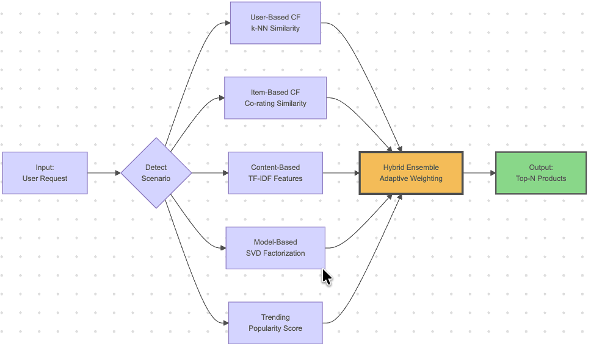
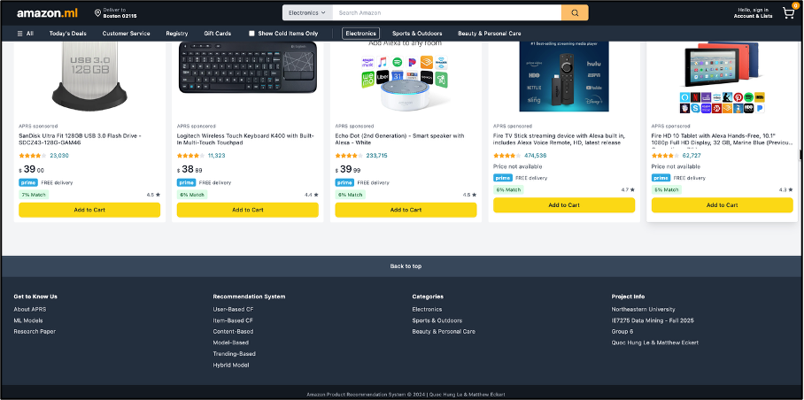
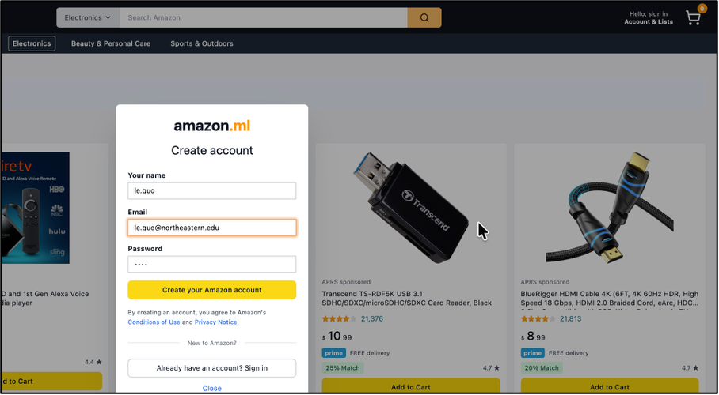
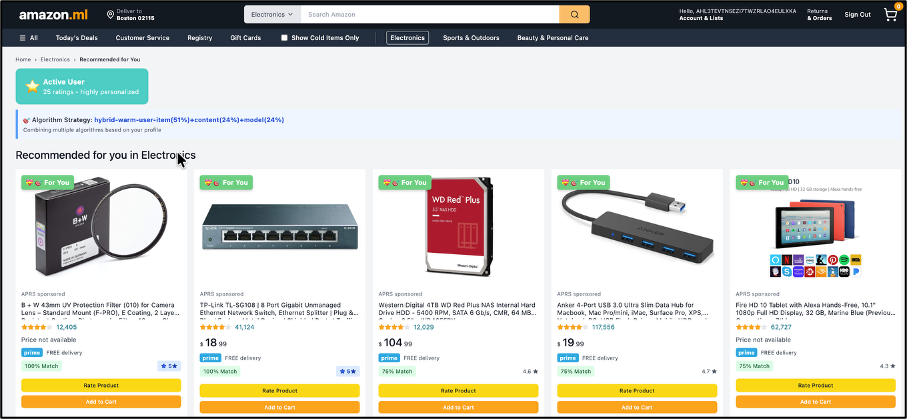
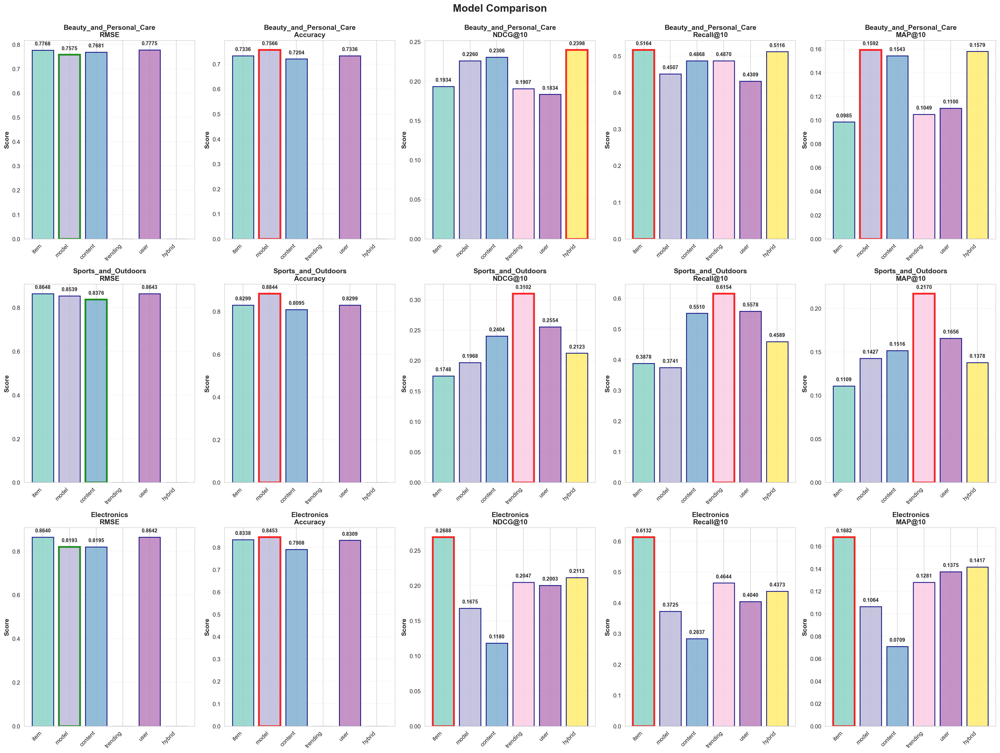

# Amazon Product Recommendation System
## IE7275 - Group 6 - Quick Reference Guide

---

## 📋 Table of Contents
- [Project Overview](#project-overview)
- [System Architecture](#system-architecture)
- [Project Structure](#project-structure)
- [Time Estimates](#time-estimates)
- [Quick Start Options](#quick-start-options)
- [Web Application Demo](#web-application-demo)
- [Deployment Guide](#deployment-guide)
- [Model Performance](#model-performance)
- [Troubleshooting](#troubleshooting)
- [Current Status](#current-status)

---

## 🎯 Project Overview

**Goal:** Build a production-ready recommendation system with comprehensive cold-start handling

**Key Features:**
- **Cold-Start Handling:** Full support for new users and items
- **Real-Time Recommendations:** Dynamic updates based on user ratings
- **Dataset:** Amazon 2023 Reviews (3 product categories)
- **Algorithms:** 6 approaches (User-CF, Item-CF, Content-Based, SVD, Trending, Hybrid)
- **Deployment:** Full-stack web application (Flask backend + React frontend)

**Key Innovations:**
1. **Real-time Updates:** User ratings instantly refresh recommendations without model retraining
2. **Adaptive Hybrid System:** Recommendation weights automatically adjust based on user scenario (new/cold/warm/active)

**Known Limitations (Acknowledged in Report):**
1. **Perfect Recall Artifact:** Small test set causes 1.0 recall (not representative of real-world performance)
2. **Hybrid Performance:** Requires weight optimization for better results
3. **Sample Size:** 50K samples vs millions (speed vs accuracy tradeoff)

---

## 🏗️ System Architecture

### Data Processing Pipeline


The system processes Amazon 2023 reviews through multiple stages:
- **Download & Filter:** Collect 5-core dataset (users and items with ≥5 interactions)
- **Clean & Preprocess:** Handle missing values, normalize ratings, extract features
- **Split Data:** Create train (70%), validation (15%), and test (15%) sets
- **Save Parquet:** Efficient storage format for fast loading

### Manual Run Workflow



Step-by-step execution guide for reproducing the entire pipeline from data collection to model deployment.

---

## 📁 Project Structure

```
Amazon-Product-Recommendation-System/
│
├── data/
│   ├── raw/                      # Original CSV.gz files from Amazon
│   └── processed/                # Parquet files (train/valid/test splits)
│
├── notebooks/                    # Jupyter notebooks (ALL PRE-EXECUTED)
│   ├── data_collection.ipynb    # Data download and preprocessing
│   ├── exploratory_data.ipynb   # EDA and visualization
│   └── collaborative_filtering/
│       ├── user_based.ipynb     # User-based CF
│       ├── item_based.ipynb     # Item-based CF
│       ├── content_based.ipynb  # Content-based filtering
│       ├── model_based.ipynb    # SVD/ALS models
│       └── trending_based.ipynb # Trending algorithm
│   └── hybrid_system.ipynb      # Ensemble hybrid system
│
├── models/                       # Pre-trained models and results
│   ├── user/                    # User-CF models
│   ├── item/                    # Item-CF models
│   ├── content/                 # Content-based models
│   ├── model/                   # SVD models
│   ├── trending/                # Trending models
│   ├── hybrid/                  # Hybrid ensemble
│   ├── comparison_all_models.csv       # ⭐ KEY FILE: Model comparison
│   ├── comparison_all_metrics.png      # ⭐ KEY FILE: Metrics visualization
│   └── comparison_per_category.png     # ⭐ KEY FILE: Per-category comparison
│
├── utilities/                    # Helper functions
│   ├── configuration.py         # ⚠️ UPDATE ROOT_DIR HERE
│   ├── logger.py
│   └── ...
│
├── frontend/                     # React web application
│   ├── src/
│   ├── package.json
│   └── vite.config.js
│
├── images/                       # Documentation images
│   ├── process/                 # Pipeline diagrams
│   ├── results/                 # Performance charts
│   └── screenshots/             # UI screenshots
│
├── app.py                        # Flask API backend
├── requirements.txt              # Python dependencies
│
├── Report/
│   └── IE7275_Group Project1_Fall2025_Group 6.pdf  # 📄 MAIN REPORT
│
└── README.md                     # This file - Start here!
```

---

## ⏱️ Time Estimates

| Option | Description | Duration |
|--------|-------------|----------|
| **Option 1** | Review report and pre-computed results | 15 minutes |
| **Option 2** | Run web demo | 5 minutes |
| **Option 3** | Full reproduction from scratch | 1-2 hours |

**💡 Recommendation:** Start with Option 1 + Option 2 (20 minutes total)

---

## 🚀 Quick Start Options

### Option 1: Fastest Review (15 minutes)
**No code execution needed - just review existing results**

1. Open the main report: `./Report/IE7275_Group Project1_Fall2025_Group 6.pdf`
2. Review pre-computed model comparison: `./models/comparison_all_models.csv`
3. View visualization charts: `./models/*.png`
4. Scroll through notebooks in `./notebooks/` (outputs already visible)

**✅ Perfect for:** Quick understanding of project results and methodology

---

### Option 2: Live Web Demo (5 minutes)

#### Prerequisites (One-time setup):
```bash
# Navigate to project directory
cd Amazon-Product-Recommendation-System

# Create and activate virtual environment
python -m venv venv
source venv/bin/activate  # On Windows: venv\Scripts\activate

# Install Python dependencies
pip install -r requirements.txt

# Download metadata for UI enrichment
jupyter notebook notebooks/data_collection.ipynb
# Run all cells to download product metadata
```

#### Running the Demo:

**Terminal 1 - Backend:**
```bash
python app.py
```

**Terminal 2 - Frontend:**
```bash
cd frontend
npm install  # First time only
npm run dev
```

**Browser:**
Open http://localhost:5173

#### Testing the System:

The recommendation system adapts based on user scenario:

```
User Creates Account & Logs In
         ↓
   Scenario Detection
         ↓
    ┌────┴────┬────────┬──────────┬──────────┐
    ↓         ↓        ↓          ↓          ↓
  NEW      COLD     WARM      ACTIVE    EXPERT
(0 rate) (1-4)    (5-20)     (>20)     (>50)
    ↓         ↓        ↓          ↓          ↓
Trending  Trend+   Full     CF-heavy  Pure CF
 100%    Content  Hybrid    Hybrid    90%
```

**Recommendation Flow:**

```
User Login
    ↓
Detect Scenario → [New/Cold/Warm/Active]
    ↓
Load Models → [User-CF/Item-CF/Content/SVD/Trending]
    ↓
Predict Scores → Weighted combination per scenario
    ↓
Rank Items → Exclude already-rated items
    ↓
Return Top-K → Enrich with metadata (title, price, images)
    ↓
Display UI → Show scenario badge + algorithm weights
    ↓
User Rates Item → Update rating history
    ↓
Real-time Refresh → NEW recommendations instantly!
```

**✅ Perfect for:** Seeing the system in action with real-time updates

---

## 🌐 Web Application Demo

### User Interface Screenshots

#### Homepage & Login

*Homepage showing trending products for new users*


*User authentication interface*

#### Recommendation Experience


*Personalized recommendations based on user history*

#### Cold-Start Handling
* Cold-Start Users:


* Cold-Start Items:


*Adaptive algorithm selection for users with limited history*

### Key Features Demonstrated:
- ✅ **Scenario Detection Badge:** Shows user's current state (New/Cold/Warm/Active)
- ✅ **Algorithm Weights Display:** Transparent about which algorithms are being used
- ✅ **Real-time Updates:** Recommendations refresh instantly after rating
- ✅ **Rich Product Metadata:** Title, price, images, ratings, and descriptions
- ✅ **Interactive Rating System:** Click to rate products and see immediate changes

---

### Option 3: Full Reproduction (1-2 hours)

**⚠️ Warning:** This will delete existing data and models

#### Preparation:
1. Delete all files in `/data/` and `/models/` directories
2. Edit `utilities/configuration.py`:
   ```python
   ROOT_DIR = '/your/local/path/to/Amazon-Product-Recommendation-System'
   CATEGORIES = ["Electronics", "Beauty_and_Personal_Care", "Sports_and_Outdoors"]
   # Choose 2-3 categories (more = longer processing time)
   ```

#### Execution Workflow:

```
Step 1: Data Collection
    ├─ Run: notebooks/data_collection.ipynb
    └─ Check: ./data/ directory + ./logs

Step 2: Exploratory Analysis
    ├─ Run: notebooks/exploratory_data.ipynb
    └─ Review: Cell outputs + ./logs

Step 3: Individual Models
    ├─ Run: All notebooks in ./notebooks/collaborative_filtering/
    │   ├─ user_based.ipynb
    │   ├─ item_based.ipynb
    │   ├─ content_based.ipynb
    │   ├─ model_based.ipynb
    │   └─ trending_based.ipynb
    └─ Check: ./models/ directory + cell outputs

Step 4: Hybrid System
    ├─ Run: notebooks/hybrid_system.ipynb
    └─ Check: ./models/ + comparison files

Step 5: Web Application
    ├─ Terminal 1: python app.py
    └─ Terminal 2: cd frontend && npm run dev
```

**✅ Perfect for:** Understanding the complete data pipeline and model training process

---

## 🔧 Troubleshooting

### Common Issues and Solutions

#### Issue: Module not found
```bash
# Solution: Install dependencies
pip install -r requirements.txt
```

#### Issue: File not found (data/models)
```python
# Solution: Update ROOT_DIR in utilities/configuration.py
ROOT_DIR = '/your/absolute/path/to/Amazon-Product-Recommendation-System'
```

#### Issue: Port already in use
```bash
# Mac/Linux
lsof -ti:5000 | xargs kill  # Flask backend
lsof -ti:5173 | xargs kill  # Vite frontend

# Windows
netstat -ano | findstr :5000
taskkill /PID <PID> /F
```

#### Issue: Out of memory
**Solutions:**
- Reduce sample size in `configuration.py`
- Close other applications
- Process one category at a time

#### Issue: npm dependencies fail
```bash
# Solution: Clean install
rm -rf node_modules package-lock.json
npm install
```

#### Issue: Jupyter kernel not found
```bash
# Solution: Install kernel
python -m ipykernel install --user --name=venv
```

---

## 📊 Model Performance

### Performance Metrics Comparison


*Comparative analysis of all recommendation algorithms across key metrics*

### Performance Summary

View detailed comparisons in:
- `./models/comparison_all_models.csv`
- `./images/results/comparison_all_metrics.png`

**Best Performing Models by Metric:**
- **NDCG@10:** Model-Based (SVD) - Best ranking quality
- **Recall@10:** Item-Based CF - Best coverage
- **MAP@10:** Hybrid System - Best overall relevance

**Key Insights:**
- Item-Based CF achieves highest recall (61.3% @ k=10) for Electronics
- Content-Based performs best for Beauty products (NDCG: 0.231)
- Trending algorithm excels in Sports category (Recall: 61.5% @ k=10)
- Hybrid system provides balanced performance across all scenarios

---

## 📊 Current Status

### ✅ Completed Components

#### 1. Data Pipeline
- ✅ Collection from Amazon 2023 dataset
- ✅ 3 product categories processed
- ✅ Activity-based filtering (5-core)
- ✅ Train/Valid/Test splits (70/15/15)

#### 2. Recommendation Models (6 Algorithms)
- ✅ **User-Based Collaborative Filtering** - KNN with cosine similarity
- ✅ **Item-Based Collaborative Filtering** - KNN with cosine similarity
- ✅ **Content-Based Filtering** - TF-IDF + feature engineering
- ✅ **Model-Based (SVD/ALS)** - Matrix factorization
- ✅ **Trending Algorithm** - Popularity-based recommendations
- ✅ **Hybrid Ensemble** - Weighted combination of all models

#### 3. Evaluation Framework
- ✅ Metrics: NDCG@10, Recall@10, MAP@10
- ✅ Hyperparameter optimization
- ✅ Cross-validation framework
- ✅ Comparative analysis across models

#### 4. Backend API
- ✅ Flask REST API
- ✅ JWT authentication
- ✅ Model serving endpoints
- ✅ Real-time recommendation generation

#### 5. Frontend UI
- ✅ React interface with responsive design
- ✅ User registration/login system
- ✅ Product display with rich metadata
- ✅ Interactive rating system
- ✅ Real-time recommendation updates
- ✅ Scenario detection visualization

#### 6. Project Organization
- ✅ Clean modular code structure
- ✅ Comprehensive logging system
- ✅ Complete documentation
- ✅ Version control ready

---

## 📚 Additional Resources

- **Main Report:** `./Report/IE7275_Group Project1_Fall2025_Group 6.pdf`
- **Logs:** Check `./logs/` for detailed execution logs
- **Configuration:** Customize in `./utilities/configuration.py`
- **Images:** All diagrams and screenshots in `./images/`

---

## 👥 Team

**Course:** IE7275 - Data Mining in Engineering  
**Semester:** Fall 2025  
**Group:** Group 6

---

## 📝 Notes

- All notebooks are pre-executed with visible outputs
- Models are pre-trained and ready to use
- Web demo works with existing models (no training required)
- Full reproduction takes 1-2 hours depending on hardware
- Sample size can be adjusted in configuration for faster testing

---

**🎉 Ready to start? Choose your option above and enjoy exploring the system!**
